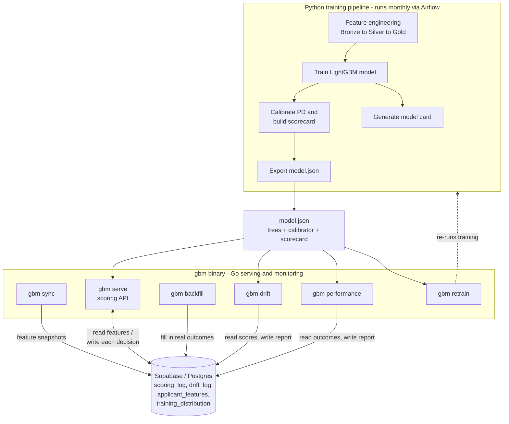
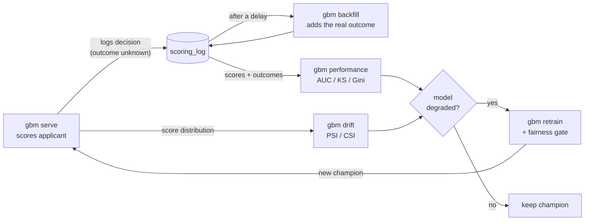
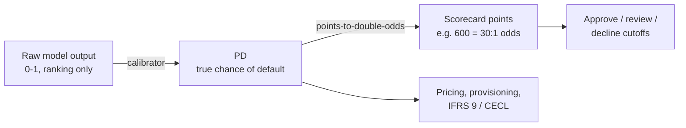
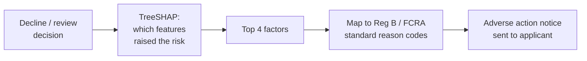
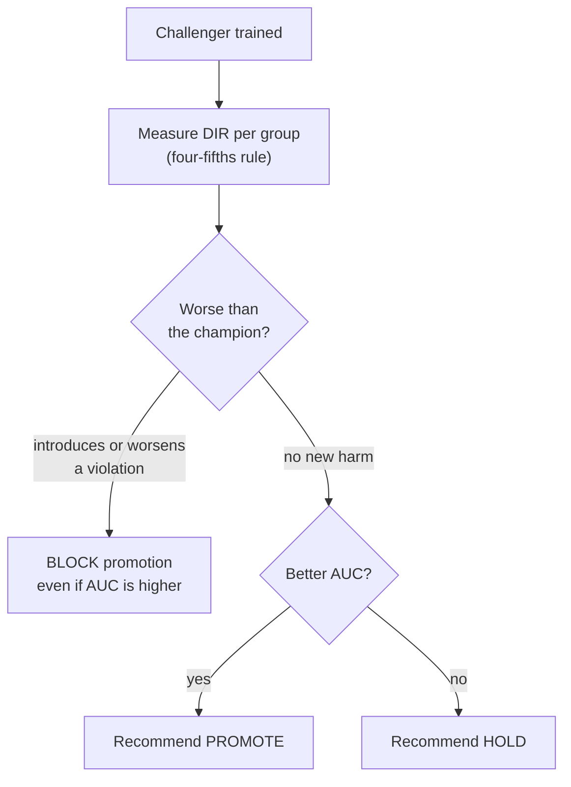
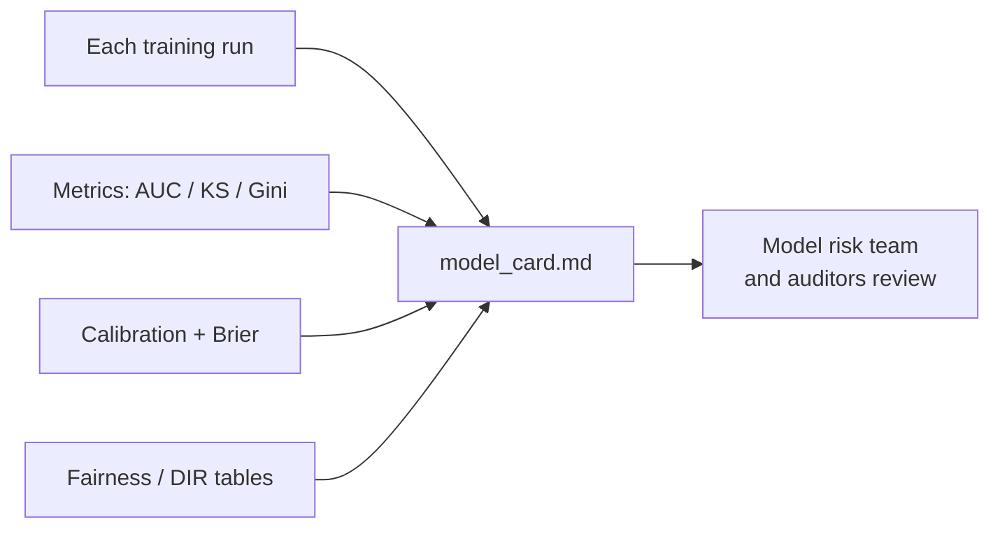
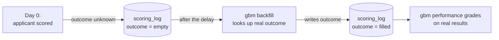

# Credit-Risk Capabilities — A Plain-Language Tour

A trained model is only the starting point. To run a lending decision that a
risk team and a regulator will accept, you need more than accuracy — the score
has to be *honest*, the decision has to be *explainable* and *lawful*, the model
has to be *fair* and *documented*, and the monitoring has to measure *reality*.

This document walks through the six credit-risk capabilities built on top of the
model, in everyday terms, and shows how the pieces talk to each other. For the
engineering deep-dive on calibration and serving, see
[`calibration-and-serving.md`](calibration-and-serving.md).

| Capability | In one line | Lives in |
|------------|-------------|----------|
| Probability calibration | Turns the raw score into a *real* probability of default | `pipeline/calibrate.py` → `shared/model` |
| Scorecard scaling | Maps that probability to a familiar points score | `pipeline/calibrate.py` → `shared/model` |
| Adverse action reasons | Tells a declined applicant *why*, in legally-required terms | `inference/` (uses TreeSHAP) |
| Fairness gate | Blocks a new model that would treat groups less fairly | `gbm retrain` + `pipeline/fairness.py` |
| Model card | Auto-writes the validation report risk teams sign off on | `pipeline/model_card.py` |
| Outcome backfill loop | Feeds *real* loan outcomes back so monitoring is honest | `gbm backfill` |

---

## The big picture

The system has three moving parts: a **Python pipeline** that builds and trains
the model, a single **`gbm` binary** (Go) that serves scores and runs the
monitoring jobs, and a **database** that remembers every decision. The model
itself is handed off as one file — `model.json` — so the serving layer never
needs Python.

**The closed loop.** The real point of the monitoring jobs is that they form a
loop: every decision is logged, real outcomes are filled in later, performance
and drift are measured against them, and if the model has degraded a new one is
trained — fairness-checked — and promoted. That loop is what separates a demo
from a system that can run unattended.

---

## A. Turning a score into a real, usable decision

### 1. Probability calibration

**What it is.** A gradient-boosted model outputs a number between 0 and 1, but
that number only *ranks* applicants — it puts riskier people higher. It does not
promise that "0.20" means "20 out of 100 such applicants will default."
Calibration fixes that: it learns the relationship between the model's scores and
the default rates actually observed, and bends the scores onto that curve. The
correction only stretches or compresses the scale — it never reorders anyone — so
the model's ranking power (AUC, KS, Gini) is untouched. The output afterwards is
a genuine **probability of default (PD)**.

**Why it matters.** Everything downstream of a PD treats it as a literal
probability: risk-based pricing, expected loss (`PD × LGD × EAD`), and how much
money the lender must set aside under **IFRS 9 / CECL**. A score that "ranks well"
but isn't a true probability quietly mis-prices loans and mis-states reserves.
Calibration — and the evidence that comes with it (a *Brier score* and a
reliability table comparing predicted vs. actual default rates) — is exactly what
a model validation team expects to see.

### 2. Scorecard scaling

**What it is.** Once you have an honest PD, you translate it into a familiar
**points score** — the kind of 300-to-850-style number underwriters are used to.
This uses the industry-standard *points-to-double-odds* convention: pick an anchor
(here, 600 points = 30:1 good-to-bad odds) and a rule for how many points double
the odds (here, 20). Higher score = safer applicant, on a stable, intuitive scale.

**Why it matters.** Risk officers, operations, and regulators expect a score on a
predictable scale, not a raw probability. It makes cutoffs easy to set and
explain, comparable over time, and consistent with bureau-style scores. The API
returns both numbers — the PD for the math, the points score for the humans.

---

## B. Explaining and justifying the decision

### 3. Adverse action reasons (with regulatory codes)

**What it is.** When an applicant is declined or sent to manual review, the system
works out *which factors pushed their risk up* using **TreeSHAP** (a method that
fairly attributes a prediction to each input feature), takes the top four, and
maps each to a standardized **Regulation B / FCRA reason** — the exact kind of
statement a lender is allowed to put on a decline notice (e.g. "Excessive
obligations in relation to income"). Each reason carries a stable code, a
plain-English feature name, and the direction of impact.

**Why it matters.** Under **ECOA (Regulation B)** and the **FCRA**, a declined
applicant is legally entitled to the specific principal reasons for the decision.
SHAP explains *which* features drove the model; the code mapping is the bridge
from "model internals" to the compliant, recognized language a lender must send.
It turns a black-box decision into a defensible, legally-adequate explanation —
and it happens at scoring time, so there's no separate explainability step.

---

## C. Keeping the model fair and governed

### 4. Fairness gate in promotion

**What it is.** When a challenger model is trained to replace the current champion,
accuracy alone shouldn't decide whether it goes live. The fairness gate measures
the **Disparate Impact Ratio (DIR)** — how a group's approval rate compares to the
most-approved group — against the well-known **four-fifths (80%) rule**, on proxy
attributes like home-ownership and income-verification status. It is deliberately
**champion-relative**: it only blocks a new model if it *introduces a new* unfairness
or *worsens an existing* one — not simply because some disparity exists (the data
already carries inherent disparity). If the gate trips, fairness overrides
accuracy: the recommendation becomes "do not promote," even if the new model has a
higher AUC.

**Why it matters.** **ECOA** prohibits lending discrimination, including
unintentional *disparate impact*, and **SR 11-7** model-risk governance expects
fairness to be a gate on deployment, not an afterthought. This encodes one
principle directly into the pipeline: a more accurate model that harms a protected
group is not promotable. The champion-relative design is the pragmatic version —
it avoids declaring every model undeployable just because the underlying data is
imperfect.

### 5. Model card / validation report

**What it is.** Every training run automatically writes a one-page **model card** —
a markdown report containing everything a model-risk team reviews: a headline
validation status (e.g. "REVIEW REQUIRED" with the reasons listed), the data
window and split sizes, the discrimination metrics (AUC / KS / Gini), the
calibration evidence, the fairness tables, and the hyperparameters.

**Why it matters.** **SR 11-7** requires *documented* validation evidence, and a
model card is the standard artifact that model risk management and auditors
consume. Auto-generating it means the documentation can never quietly drift away
from the model that's actually deployed, and the validation-status line turns the
whole report into a clear go / no-go signal.

---

## D. Closing the monitoring loop

### 6. Outcome backfill loop

**What it is.** Here's the catch with monitoring a credit model: at the moment you
approve a loan, you don't yet know whether it will default — that answer arrives
months or years later. So when each decision is logged, its "real outcome" column
starts empty, and the performance monitor has nothing real to grade itself against.
The backfill job solves this by simulating outcomes *maturing*: after a set delay,
it looks up the true outcome for each previously-scored applicant and writes it
back. Once enough real outcomes accumulate, the performance monitor switches from a
stand-in (the test set) to grading on **actual production results**.

**Why it matters.** A model's performance can only honestly be measured against
outcomes that really happened. Without an outcome-collection step, monitoring is
just measuring the model against the data it was built on — which always looks
fine. This is the unglamorous piece that makes the AUC/KS tracking — and therefore
the retraining triggers — reflect what's actually happening to the loan book.

---

## How it all ties together

Read top to bottom, the six capabilities are a chain:

1. **Calibration** makes the score a real probability, and **scorecard scaling**
   makes it usable.
2. **Adverse action reasons** make each individual decision explainable and lawful.
3. The **fairness gate** and the **model card** keep the model governed and
   auditable across versions.
4. The **outcome backfill loop** keeps the monitoring honest, which is what lets
   the whole system retrain itself responsibly over time.

Together they turn "a model that outputs a number" into "a credit decisioning
system a lender could defend."
